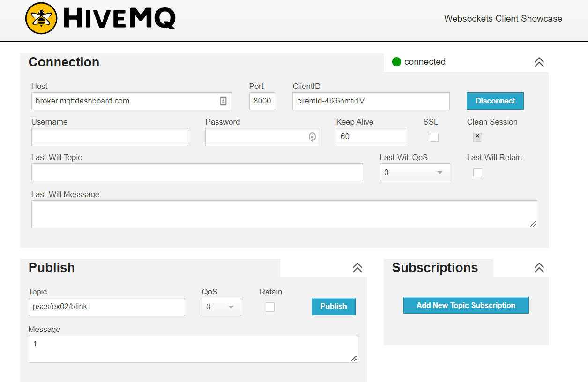

# psos_examples
PSOS Example 2 - MQTT Blink

- Assumes micropython installed on either an ESP8266 or ESP32. Links in parent directory.
- Must have onboard LEDs for this example to work
- This second example is to begin to introduce the use of MQTT
- Assumes you are already familiar with the [basics of MQTT](https://randomnerdtutorials.com/what-is-mqtt-and-how-it-works/)

- For this first MQTT example will use the [free public HiveMQ MQTT Broker](https://www.hivemq.com/public-mqtt-broker/)

- This example requires wifi as well, so we'll use a micropython `secrets.py` file to specify the wifi name and password. You'll have to edit that file for your network
    - For security reasons the `secrets.py` is never saved to github. You'll  copy the format from `example_secrets.py` and save it in your own `secrets.py` file.
- Will also be using the [HiveMQ Websocket Client](http://www.hivemq.com/demos/websocket-client/) to monitor and publish topics.

- For this example we'll be using the free HiveMQ MQTT Broker. A later example will use the free private HiveMQ MQTT Broker.
- Also begin to introduce the PSOS base python code which you'll find in the [base github directory](../base/) for this repo

## Running Example

1. Erase all of the files on your ESP8266 or ESP32 microcontroller **(make sure you have any files you want to keep backed up on your computer first!!!)**
2. Copy the files in this repos `/base/` folder to your device
3. In Thonny, create a new file
4. Copy the contents of `example_02_secrets.py` to this file
5. Save the new file to your microcontroller as `secrets.py`
6. Enter values for your home network `ssid` and `password` in the `secrets.py` section under `wifi_home`.
6. Open [HiveMQ Websocket Client](http://www.hivemq.com/demos/websocket-client/)
7. Press the `Connect` button to connect to the public HiveMQ MQTT Broker
8. Wait for Thonny to display the message `in example 02 svc_blink.run`
8. In the **Publish** section of the webpage, enter a topic of `psos/ex02/blink` and message of `1` or `0` and press the `Publish` button, as shown in screen capture below

Note that the ESP32 and ESP8266 use opposite values for turning the onboard LED on or off, so the `1` will turn off the LED on the ESP8266 but turn it on with the ESP32.

In the Thonny Shell you should also see something such as `['psos/ex02/blink', 'psos/ex02/blink', '1']` where the `1` could be `0` depending on what you published in the Websocket client.

TODO: add description of .json file and svc_blink.py program, how they connect and interact with PSOS. Also what's in the message sent to the blink program. How uasyncio suspends the task until something is put into the queue. Maybe a little bit about uasyncio.