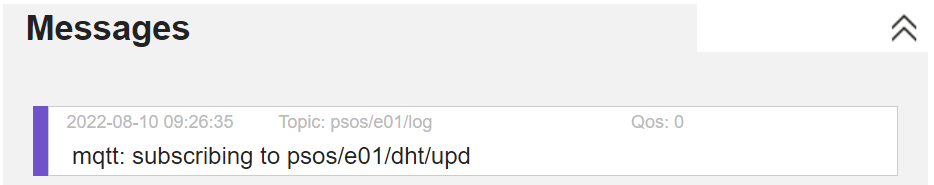

# psos_examples
PSOS Example 4 - Free HiveMQ MQTT Account

Have been using the public HiveMQ MQTT Broker, but now time to go to a private account. This allows secure communication between your devices. Don't have to worry about someone else using the same topic name.

Go to [HiveMQ Download page](https://www.hivemq.com/downloads/) and select **A free Cloud MQTT Broker that enables you to connect up to 100 devices.**

Once signed up you'll be able to see you HiveMQ console


The first part of the URL for your service is unique. You may want to copy that as you'll need it later in this example.

Press the **Manage Cluster** button and then the **Access Management** tab at the top of the window to add a new credential for your devices.


You'll also need that user name and password to connect to your HiveMQ MQTT broker from your microcontrollers or websocket web page.

Use the `secrets_example.py` file in this folder to create a `secrets.py` file. The new `secrets.py` file will contain two new sections. At the begining is a statement defined the HiveMQ Root Certificate Authority (root CA)

```python
# MQTT certificates
from hivemq_root_ca import hivemq_root_ca
```

Following that is a new section in the `secrets.py` file `mqtt={...}` section for the new MQTT broker

```python
    "mqtt_hivemq" :{
        'server' : 'xxxxxxxxxxxx.s1.eu.hivemq.cloud',
        'port'   : 8883,
        'username' : 'xxxxxx',
        'password' : 'yyyyyy',
        'ca_cert'  : hivemq_root_ca
        }
```

In that section you'll need to fill in the values for `server`, `username` and `password`. The example values for the `port` and `ca_cert` are the same for all free HiveMQ accounts.

You'll also need to reenter your WiFi ssid and password in the wifi section of the `secrets.py` or copy that from your example 3 `secrets.py` file:

```python
# WiFi environments
wifi =  {
    "wifi_home":{
        'ssid'     : 'xxxxx',
        'password' : 'xxxxx'
        }
    }
```

Finally, the JSON parms have been modified slightly to change the value of a parameter used for the MQTT service from `"broker":"mqtt_hivemq_public"` to `"broker":"mqtt_hivemq"` so we now define the MQTT service as 

```json
        {"name": "mqtt", "module":"svc_mqtt",  "broker":"mqtt_hivemq" },
```

We'll also have a slight change the [Websocket web page client](http://www.hivemq.com/demos/websocket-client/?) previously used to monitor and generate MQTT messages as shown in the screen capture below.


Note the following changes from the previous websocket page:
1. The host is the value for your HiveMQ host 
2. Port is now 8884
3. Username and Password are now required
4. Check the SSL box

Press connect and you should be able to connect to your HiveMQ broker!

Now subscribe to the same topic as the previous example, to the topic `psos/#` with a QoS of 0.

Now update and run your microcontroller(s)
- save either the `esp32_psos_parms.json` or `esp8266_psos_parms.json` to the microcontroller under the name `psos_parms.json`
- run `main.py` on the ESP32 and/or ESP8266

On the websocket web page you should see a log message 



Using the webpage publish a message to the topic specified in the log message


You should then see two new messages on the web page


Just as an aside, entering your host, username and password on the webpage can be a bit of a pain. Easing that a bit is that you copy that information from your `secrets.py` file. You'll also need to change the port to 8884 and check the SSL box.

**Careful!** The websocket client uses port 8884, a different port from your microcontroller which uses port 8883.