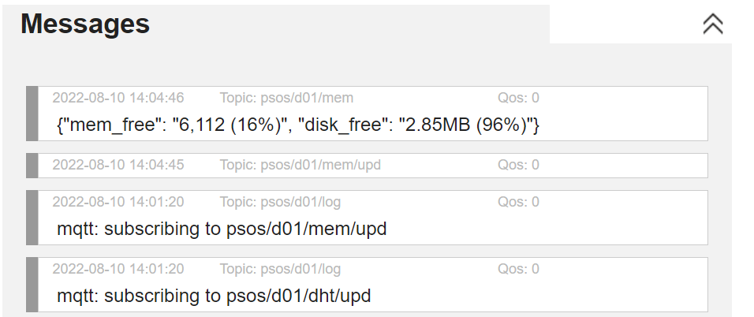
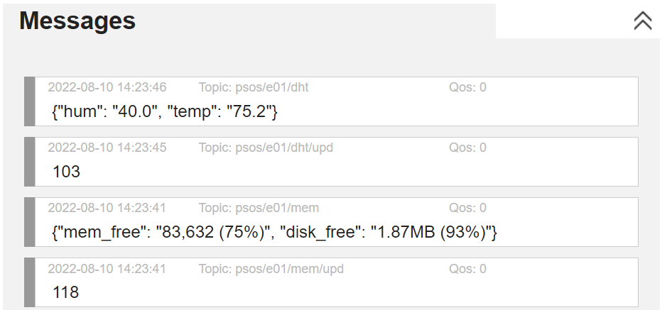

# psos_examples
PSOS Example 5 - ESP32 Capacitive Touch Sensor and Memory Use

This example uses the same websocket webpage client as the previous example. Refer to the readme in the previous example for how to:
1. connect to your private MQTT broker
2. subscribe to the `psos/#` topic with a QoS of 0

The memory service works with both the ESP8266 as well as the ESP32, while the capacitive touch sensors are only available on the ESP32.

If your ESP8266 microcontroller is still set up from the last example all you'll need to do is download the `esp8266_psos_parms.json` file to the device under the name `psos_parms.json`. For this example the following lines were added to the `esp8266_psos_parms.json` file:

```json
        {"name": "mem_use", "module":"svc_mem_use", 
             "subscr_upd":"psos/d01/mem/upd",   "pub_upd":"psos/d01/mem"}
```

Run the esp8266 main in Thonny and you should see a new subscription notifications. In the Thonny shell these will appear as

```
main: starting services
subscribe psos/d01/dht/upd
subscribe psos/d01/mem/upd
```

You'll see similar lines in the websocket webpage. If you then use the websocket webpage client publish to `psos/d01/mem/upd` you'll see something like this:




For the ESP32 microcontroller you'll save the `esp32_psos_parms.json` file as `psos_parms.json`. In addition to the `touch_svc` definition, there are two additional services being started, both the `svc_touch` service but with different pins, pins 15 and pin 4.

```json
        {"name": "mem_use", "module":"svc_mem_use", 
             "subscr_upd":"psos/e01/mem/upd",   "pub_upd":"psos/e01/mem" },
             
        {"name": "touch15", "module":"svc_touch", "pin":15, "threshold":300,
             "pub_touch":"psos/e01/dht/upd" },
             
        {"name": "touch4",  "module":"svc_touch", "pin":4, "threshold":300,
             "pub_touch":"psos/e01/mem/upd" }
```

Looking at the parameters for the two touch services, notice the `pub_touch` values for the two services. One is `"pub_touch":"psos/e01/dht/upd"` and the other is `"pub_touch":"psos/e01/mem/upd"`. Also notice the threshold parameter which is set to 300 for each service. What will happen is that when the capacitance for the pins falls below 300, which will happen when you touch the end of the jumper wire, the touch service will publish the value in the `pub_touch` topic. This in turn will trigger the dht or memory use service to publish their current values.

Attach jumper wires to pins D15 and D4, then run the `main.py` file. The Thonny Shell should show the following:

```
main: starting services
subscribe psos/e01/dht/upd
subscribe psos/e01/mem/upd
starting touch sensor touch15
starting touch sensor touch4
```

Similar subscribing messages should show in the websocket webpage client as well. If you touch the ends of each of the jumper wires you'll also see messages such as the following in the websocket webpage.



Note that if you want to, you can easily change the `pub_touch` topics in the JSON file to be `psos/d01/dht/upd` and `psos/d01/mem/upd` and the values reported will be from the ESP8266.
